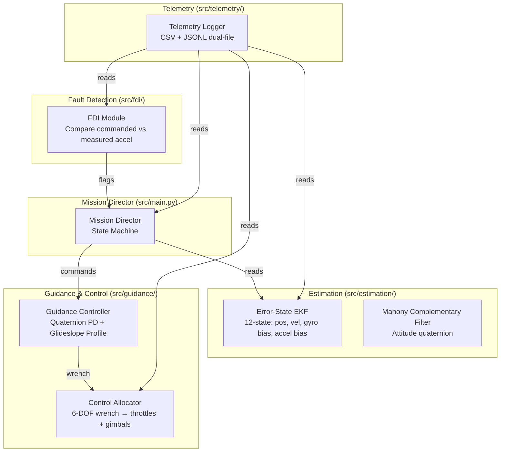

<div align="center">

# 🛡️ AEGIS

**Autonomous Estimation & Guidance Integrated System**

[](https://www.python.org/downloads/)
[](./LICENSE)
[]()

*A fault-tolerant, aerospace-grade autonomous landing system for Kerbal Space Program.*

AEGIS deliberately injects Gaussian noise into sensor telemetry and must survive asymmetric engine failures during powered descent using state estimation, fault detection, and dynamic control allocation.

</div>

---

## Table of Contents

- [Overview](#overview)
- [Quick Start](#quick-start)
- [System Architecture](#system-architecture)
- [Key Features](#key-features)
- [Performance Metrics](#performance-metrics)
- [Real-World Inspiration](#real-world-inspiration)
- [Setup & Execution](#setup--execution)
- [Testing](#testing)
- [Configuration](#configuration)
- [Architecture Decisions](#architecture-decisions)
- [Documentation](#documentation)
- [NN-ADRC Roadmap](#nn-adrc-integration-roadmap)
- [Contributing & Review Process](#contributing--review-process)
- [License](#license)
- [References](#references)

---

## Overview

AEGIS is an autonomous landing system built around a **50 Hz real-time control loop** that drives a multi-engine spacecraft from orbit to touchdown — fully autonomously. It fuses noisy IMU, altimeter, and velocimeter data in a 12-state Extended Kalman Filter, detects actuator faults in real time, and redistributes control authority across surviving engines to maintain stable descent even after losing up to 4 of 8 engines.

### What makes it hard?

- **Sensor noise injection** — All telemetry (position, velocity, IMU, altimeter) is deliberately corrupted by Gaussian noise before reaching the estimator.
- **Asymmetric engine failures** — The Fault Detection & Isolation (FDI) module must identify which specific engine failed from acceleration residuals, then remap the control allocation on the next tick.
- **No reaction wheels** — Attitude control is entirely via differential throttling and independent per-engine gimbal trim.
- **Suicide burn guidance** — The guidance controller flies a real-time sqrt glideslope profile computed from actual TWR and remaining altitude, with no margin for error.

---

## Quick Start

```bash
# 1. Clone the repository
git clone https://github.com/yourusername/AEGIS.git && cd AEGIS

# 2. Set up the virtual environment (WSL2 + Arch + uv)
uv venv

# 3. Install dependencies
uv pip install -r requirements.txt

# 4. Run the Mission Director (ensure KSP + kRPC server is running)
.venv/bin/python src/main.py [--debug] [--log-to-file]
```

For detailed setup instructions, see the [Setup & Execution](#setup--execution) section below.

---

## System Architecture



### Architecture Summary

| Module | Files | Responsibility |
|--------|-------|----------------|
| **Mission Director** | `src/main.py` | Orchestrates flight phases via a hierarchical state machine. Handles contingency branching (engine failure, dt spikes, degenerate allocation). |
| **State Estimator** | `src/estimation/ekf.py`, `src/estimation/mahony_estimator.py` | 12-state Error-State EKF fusing IMU, altimeter, and velocimeter. Mahony filter provides attitude from bias-corrected gyro rates. Dynamic gravity model using kRPC body params. |
| **Fault Detection & Isolation** | `src/fdi/fdi.py` | Compares expected vs measured acceleration. Isolates engine failures by brute-forcing failure combinations. Triggers `HARD_ABORT` on multi-engine failures or degenerate allocation. |
| **Guidance & Control** | `src/guidance/controller.py`, `src/guidance/allocator.py` | Quaternion PD attitude control with inertia-scaled torque and gyroscopic feedforward. Suicide-burn sqrt glideslope for translation. 6-DOF pseudo-inverse control allocator with condition number checks. |
| **Telemetry & Logging** | `src/telemetry/` | Dual-file logging: per-tick CSV (`telemetry.csv`) and discrete event JSONL (`events.jsonl`). Buffered I/O prevents blocking the 50Hz loop. |

### State Machine

```
STANDBY → ASCENT_COAST → DEORBIT_BURN → HYPERSONIC_COAST → POWERED_DESCENT → HOVER_TARGETING → TERMINAL_DESCENT → LANDED
                                                                         ↓
                                                                  HARD_ABORT (fault)
```

**Contingency triggers:**
- **Single engine failure** → FDI isolates, allocator remaps wrench.
- **2+ simultaneous failures** → Immediate `HARD_ABORT`.
- **Degenerate allocation** (B matrix condition number > 1e4) → `AllocationDegenerateError` → `HARD_ABORT`.
- **Vessel destroyed** → Immediate `HARD_ABORT`.
- **DT spike** (game lag > 3× expected tick) → Skips KF predict, holds FDI, but **guidance still runs** to prevent free-fall.

---

## Key Features

### 🧭 State Estimation
- **12-state Error-State EKF** estimates position, velocity, gyroscope bias, and accelerometer bias.
- **Mahony complementary filter** provides attitude from bias-corrected gyro rates.
- **Frame-safe gravity modeling** using kRPC `vessel.flight.g_force` and `body.gravitational_parameter`.
- Mass treated as a clean external telemetry parameter.

### ⚠️ Fault Detection & Isolation
- Compares expected acceleration (commanded throttle + known mass) against measured acceleration.
- Configurable threshold (`FDI_THRESHOLD = 3.0`) with 50-tick persistence.
- Isolates failing engine by brute-forcing failure combinations.
- Multiple simultaneous failures trigger `HARD_ABORT`.

### 🎯 Guidance & Control
- **Quaternion-based PD attitude controller** (ADR-019) with inertia-scaled torque using the full 3×3 inertia tensor.
- **Suicide-burn sqrt glideslope profile**: `v_target = -sqrt(2 * a_avail * alt_above_floor)`.
- **Acceleration clamping** (`ACCEL_CLAMP_FACTOR`) prevents attitude target flipping during saturating transients.
- **6-DOF control allocation** via pseudo-inverse with real-time condition number monitoring.
- **Per-engine gimbal control** via ModuleGimbalTrim mod (ADR-024).

### 📊 Telemetry & Logging
- **Dual-file logging**: Dense per-tick CSV + discrete event JSONL.
- **Buffered I/O** (1MB) prevents blocking the 50Hz control loop.
- **`logs/latest` symlink** points to the most recent run.
- Post-flight analysis scripts for trajectory and attitude.

---

## Performance Metrics

| Metric | Value |
|--------|-------|
| **Control loop frequency** | 50 Hz (target ~4.4ms/tick) |
| **Number of engines (ATV)** | 8 |
| **Gimbal DOF** | Independent X/Y per engine |
| **State vector dimension** | 12 (EKF) + 4 (attitude) |
| **Test suite** | 149 passed, 13 skipped (recording-dependent), 0 failures |
| **Best pre-fix hover** | 12.0m dist, 24.8m/s vh at touchdown |

---

## Real-World Inspiration

<div align="center">
  
  
  
</div>

- *SpaceX Crew Dragon* — Redundant engine clusters for safety-critical descent.
- *Blue Origin Blue Moon MK2* — Lunar lander concept with multiple independently-gimballed engines.

To effectively test the control allocation algorithms, AEGIS expects a redundant, multi-engine vehicle layout. This design mimics real-world spacecraft that rely on differential throttling and gimbaling to maintain control after engine failures.

---

## Setup & Execution

The execution environment for AEGIS is strictly contained within a Linux environment using WSL (Windows Subsystem for Linux) with the Arch distribution. Dependency management and virtual environments are handled by `uv`.

### Prerequisites

- Kerbal Space Program with the **kRPC** mod installed and server running.
- Windows Subsystem for Linux (WSL) running the **Arch** distribution.
- `uv` installed in WSL.

### Installation

Clone the repository and set up the virtual environment:

```bash
wsl -d Arch
uv venv
uv pip install -r requirements.txt
```

### Running the System

Execution, type-checking, and tests must be run using the `.venv` inside WSL.

**Run the Mission Director:**
```bash
wsl -d Arch .venv/bin/python src/main.py [--debug] [--log-to-file]
```

**Run Static Analysis:**
```bash
wsl -d Arch .venv/bin/mypy .
```

**Run Tests:**
```bash
wsl -d Arch .venv/bin/pytest
```

### WSL2 Connection

WSL2 runs in a Hyper-V VM with its own IP space. The Windows host IP is resolved dynamically from `/etc/resolv.conf` (the `nameserver` entry) rather than hardcoding localhost (ADR-015). The `KRPC_ADDRESS` environment variable can override the default.

---

## Testing

### Two-Tier Test Harness (ADR-012)

To iterate quickly without running full KSP scenarios, AEGIS uses a two-tier approach:

**Tier 1 — Unit Tests (pytest):** Pure mathematical verification of individual modules with synthetic inputs. Each module can be tested and mocked independently. Tests cover the Kalman filter, control allocator pseudo-inverse solver, FDI isolation logic, and quaternion math.

**Tier 2 — Live KSP Validation:** Final tuning and verification runs against the actual game engine using kRPC. The live test vessel (ATV — AEGIS Test Vehicle) requires:
- A redundant cluster of 8 independently-gimballed engines in an octagonal layout.
- Reaction wheels disabled (test the engines, not magic torque wheels).
- Each engine tagged with "AegisEngine" for discovery via `vessel.parts.with_tag()`.

### Automated Hyperparameter Tuning (Optuna)

Because tuning 17 interdependent parameters manually is infeasible, AEGIS includes an **Optuna**-based tuning script (`scripts/tune_config_optuna.py`) using the TPE algorithm. It evaluates parameter sets by loading a standardized KSP save (`aegis_tune_start`), injecting parameters dynamically, running the Mission Director, and computing a fitness score based on landing distance and fuel consumption. Results persist to `logs/optuna.db`.

---

## Configuration

All runtime parameters are defined in `.conf` files under `src/config/`:

| File | Purpose |
|------|---------|
| `aegis.conf` | Main mission parameters (altitude thresholds, approach gains, etc.) |
| `ekf.conf` | EKF process and measurement noise covariance (Q/R) |
| `engines.conf` | Engine-specific parameters (thrust, ISP, gimbal limits) |
| `glideslope.conf` | Suicide-burn profile parameters |
| `sensors.conf` | Sensor noise characteristics and FDI thresholds |
| `kRPC.conf` | kRPC server connection settings |

Configuration is loaded dynamically at startup via the config package (`src/config/__init__.py`).

---

## Architecture Decisions

| ADR | Decision |
|-----|----------|
| ADR-001 | kRPC + Python over native kOS |
| ADR-002 | Strict type-hints + mypy enforcement |
| ADR-003 | Four strictly decoupled modules |
| ADR-007 | Discrete-Time Kalman Filter (6-state) |
| ADR-010 | Condition number threshold (1e4) for B matrix |
| ADR-012 | Two-tier test harness (pytest + live KSP) |
| ADR-013 | Dual-file CSV+JSONL telemetry logging |
| ADR-015 | Dynamic WSL2 host IP resolution |
| ADR-016 | Engine discovery via part tags |
| ADR-017 | Custom landing-pad-centered reference frame |
| ADR-019 | Quaternion-based PD attitude controller |
| ADR-022 | Suicide-burn sqrt glideslope profile |
| ADR-024 | ModuleGimbalTrim for individual gimbal control |
| ADR-026 | Optuna hyperparameter tuning |
| ADR-027 | ESO lives in Guidance, not State Estimator |
| ADR-028 | Vessel inertia tensor sourcing for guidance |
| ADR-029 | 6-state KF sufficient for Phase 1 (EKF deferred) |
| ADR-030 | Error-State EKF with Mahony attitude and dynamic gravity (supersedes ADR-007, ADR-014) |

---

## Documentation

- [Architecture Design](docs/architecture_design.md)
- [Vessel Design](docs/vessel_design.md)
- [Configuration Guide](docs/config.md)
- [Data Flow & Telemetry](docs/data_flow_telemetry.md)
- [Architecture Contracts](.agents/shared/context/ARCHITECTURE.md)
- [Architecture Decision Log](.agents/shared/context/DECISIONS.md)
- [Known Issues](.agents/shared/context/OPEN_ISSUES.md)
- [NN-ADRC Integration Report](docs/NN-ADRC/NN-ADRC_integration.md)
- [NN-ADRC Design Advisory](docs/NN-ADRC/NN_ADRC_DESIGN_ADVISORY.md)

---

## NN-ADRC Integration Roadmap

The current PD guidance controller has no inherent disturbance rejection. The NN-ADRC roadmap upgrades the control architecture with an **Active Disturbance Rejection Controller** augmented by a **Neural Network compensator** to learn optimal counter-actions for any asymmetric failure pattern. The ESO equations, `fal()` nonlinearity, WSEF structure, and NN training approach are drawn from *NN Based Active Disturbance Rejection Controller for a Multi-Axis Gimbal System* (Leblebicioglu et al.) — see References.

### Architecture Constraint

The Extended State Observer (ESO) lives in Guidance (`src/guidance/adrc.py`), not the State Estimator (ADR-027). The State Estimator now uses a 12-state Error-State EKF with a decoupled Mahony attitude filter (ADR-030, supersedes ADR-029). All cross-module signals are routed through the Mission Director (ADR-013 pattern) — no direct FDI↔Guidance data access.

### Integration Roadmap

| Phase | Status | Description |
|-------|--------|-------------|
| **1** | ✅ Complete | Quaternion PD attitude control with inertia-scaled torque (ADR-028) and gyroscopic feedforward using the vessel's full 3×3 inertia tensor. ESO scaffolding in `adrc.py` with the `fal()` nonlinearity and per-axis β/b₀/δ parameter stubs. |
| **2** | 🔄 Planned | ADRC core implementation — Transient Profile Generator (TG), Weighted State Error Feedback (WSEF), and Neural Network compensator with clamped fallback. |
| **3** | 🔄 Planned | Control Allocator integration. The combined reference + NN acceleration is scaled by mass and inertia tensor into the existing 6-DOF wrench pipeline. |
| **4** | 🔄 Planned | FDI adaptation. The NN-ADRC will mask acceleration deviations. FDI is rewritten to monitor ESO disturbance estimate `z₃` and NN compensatory output `Δr̈`. |
| **5** | 🔄 Planned | Neural Network training via a "Gremlin" script that randomly kills engines during automated KSP descents. Dataset targets `Δr̈` for Levenberg-Marquardt backpropagation. |

### Preconditions

ISS-001 (FDI threshold calibration) and ISS-003 (KF Q/R tuning) must be resolved before Phase 2 ESO tuning is valid. All downstream NN tuning is invalidated and must be redone if these noise characteristics change — this is a **critical** dependency documented in the design advisory.

### Key Risk

The source gimbal paper validated the NN on smooth, continuous disturbance torques (cable drag, friction). AEGIS's primary fault mode is a **discrete step-function actuator failure** (instant engine death) — an out-of-distribution case the paper did not test. The fallback clamp and ADRC-only mode are the mitigation.

---

## Contributing & Review Process

Code changes follow a structured review workflow:

1. Developer fills `PENDING_REVIEW.md` in `.agents/shared/queue/`.
2. Reviewer evaluates against architecture contracts, numerical safety, type safety, and known issues.
3. Review output is written to `.agents/shared/reviews/REVIEW_[timestamp].md`.
4. Human makes the final merge decision.

Please ensure all code is fully type-hinted and passes `mypy` before submitting for review.

---

## License

This project is licensed under the MIT License — see the [LICENSE](LICENSE) file for details.

---

## References

The following works informed the mathematical foundations of the AEGIS guidance and estimation architecture.

| # | Source | Used In |
|---|--------|---------|
| [1] | Cornman, L. & Mei, G. *Extended Kalman Filtering*. Stanford University. | State Estimator — Error-State EKF prediction/update structure, Q/R tuning methodology. |
| [2] | Leblebicioglu, K. et al. *NN Based Active Disturbance Rejection Controller for a Multi-Axis Gimbal System*. | NN-ADRC roadmap — ESO equations, `fal()` nonlinearity, WSEF/TG structure, NN training via Levenberg-Marquardt. |
| [3] | Elbeltagy, A. et al. *Quaternion-Based Tracking Control Law Design for Tracking Mode*. | Guidance controller — quaternion error definition, inertia-scaled PD torque, gain-selection via natural frequency and damping ratio. |
| [4] | Mahony, R., Hamel, T., & Pflimlin, J. *Nonlinear Complementary Filters on the Special Orthogonal Group*. IEEE Transactions on Automatic Control, 53(5), 1203–1218, 2008. | State Estimator — Mahony complementary filter for gyro/accelerometer attitude estimation. |
