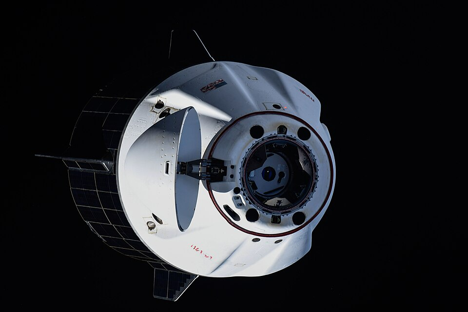
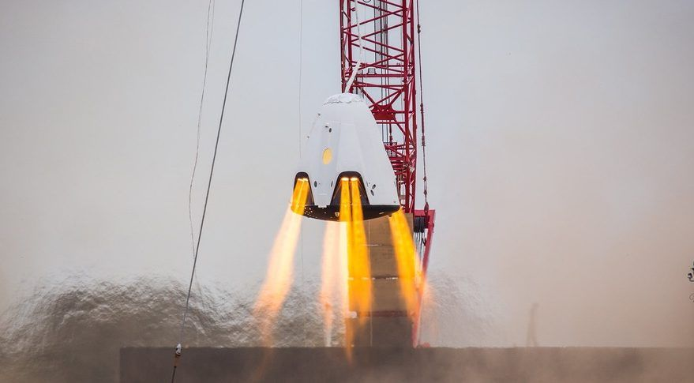
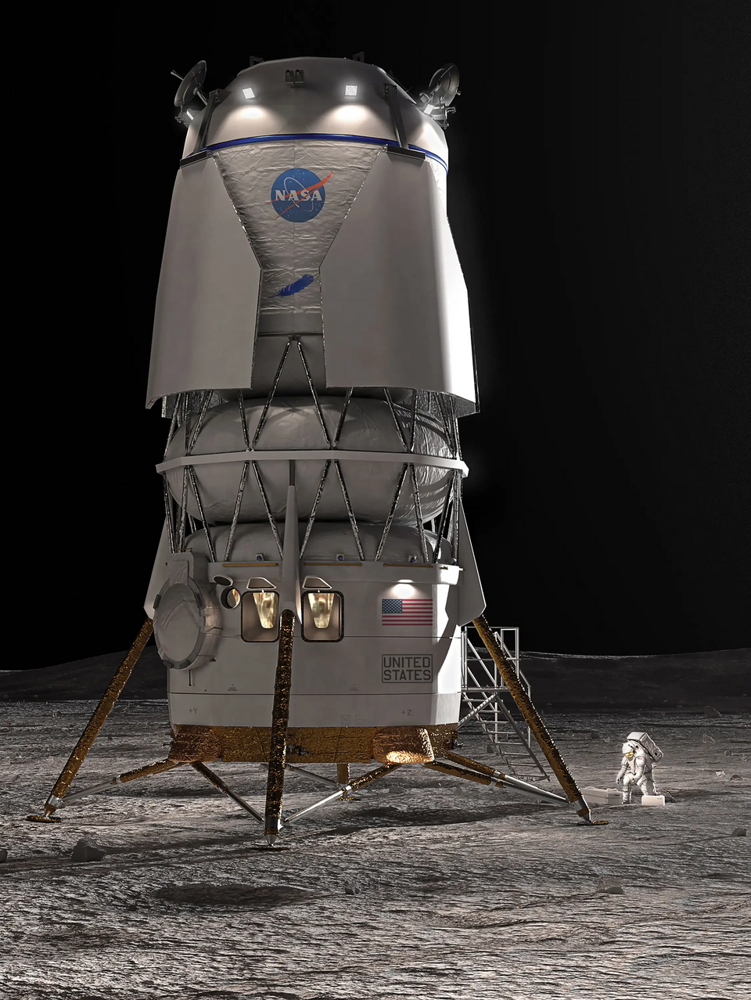

# AEGIS: Autonomous Estimation & Guidance Integrated System

AEGIS (Autonomous Estimation & Guidance Integrated System) is a fault-tolerant autonomous landing system for Kerbal Space Program, implemented in Python over kRPC.

The system deliberately injects Gaussian noise into sensor telemetry and must survive asymmetric engine failures during powered descent. It utilizes aerospace-grade State Estimation, Fault Detection, and Control Allocation to dynamically adapt and survive, guided by a robust, high-level contingency state machine.

## 1. System Architecture

The architecture is strictly decoupled into four primary domains, each owning its own state. No module may read another module's internal state — all data flows through defined interface contracts.

### The Mission Director (`src/main.py`)
A hierarchical state machine that orchestrates all modules. Manages nominal mission phases and handles contingency branching based on fault severity and flight phase.

**States:** `STANDBY` → `ASCENT_COAST` → `DEORBIT_BURN` → `HYPERSONIC_COAST` → `POWERED_DESCENT` → `HOVER_TARGETING` → `TERMINAL_DESCENT` → `LANDED` (or `HARD_ABORT` on fault).

Contingencies:
- **Single engine failure:** FDI flags the engine, allocator remaps wrench around it.
- **2+ simultaneous failures:** Immediate `HARD_ABORT`.
- **Degenerate allocation** (B matrix condition number > 1e4): `AllocationDegenerateError` → `HARD_ABORT`.
- **Vessel destroyed:** Detected in any state via `situation == "destroyed"`, triggers immediate `HARD_ABORT`.
- **DT spike** (game lag > 3× expected tick): Skips KF predict, holds FDI, but **guidance still runs** to prevent free-fall.

SAS is disabled during descent — the guidance controller handles attitude entirely via gimbal trim (inertia-scaled PD + gyroscopic feedforward per ADR-028). SAS prograde mode is used during ascent only for a stable test start.

### State Estimator (`src/estimation/estimator.py`)
A linear Discrete-Time Kalman Filter (filterpy) fusing noisy altimeter and accelerometer streams into a clean 6-state vector `[x, y, z, vx, vy, vz]` in a target-relative Cartesian frame. Mass is treated as a clean external telemetry parameter. Uses a small-angle approximation (ADR-014): attitude telemetry is treated as perfect for rotating body-frame acceleration to world frame, and accelerometer noise variance is inflated to absorb the attitude uncertainty. The Kalman filter formulation follows the standard prediction-update structure detailed in *Extended Kalman Filtering* (Cornman & Mei, Stanford University) — see References §8.

### Fault Detection & Isolation (`src/fdi/fdi.py`)
Compares expected acceleration (from commanded throttle + known mass) against measured acceleration (from the State Estimator). If the deviation exceeds a configurable threshold (`FDI_THRESHOLD = 3.0`) persistently (50 ticks), it isolates the failing engine by brute-forcing failure combinations. Multiple simultaneous failures trigger a `HARD_ABORT`.

### Guidance & Control Allocation (`src/guidance/`)
**Guidance Controller** (`controller.py`): A quaternion-based PD attitude controller (ADR-019) with inertia-scaled torque (ADR-028) using the vessel's full 3×3 inertia tensor. The quaternion error definition and gain-selection via natural frequency/damping ratio (`Kp = ωₙ², Kd = 2ζωₙ`) follow *Quaternion-Based Tracking Control Law Design for Tracking Mode* (Elbeltagy et al.) — see References §8. Translation uses a suicide-burn sqrt glideslope profile (ADR-022): `v_target = -sqrt(2 * a_avail * alt_above_floor)`, where `a_avail` is the vessel's actual TWR-derived net upward acceleration, computed each tick. An acceleration clamp (`ACCEL_CLAMP_FACTOR`) prevents attitude target flipping during saturating transients.

**Control Allocator** (`allocator.py`): Maps a 6-DOF wrench (3 forces + 3 torques) to surviving engine throttles and gimbal angles via pseudo-inverse (`numpy.linalg.pinv`). Condition number of the B matrix is checked on every solve — if > 1e4, raises `AllocationDegenerateError`. Individual engine gimbals are actuated via the **ModuleGimbalTrim** mod (ADR-024), allowing independent X/Y gimbal control per engine. Engines are discovered via `vessel.parts.with_tag("AegisEngine")` (ADR-016).

### Telemetry & Logging (`src/telemetry/`)
Dual-file logging (ADR-013): per-tick CSV (`telemetry.csv`) for dense state snapshots, and JSONL (`events.jsonl`) for discrete events (state transitions, faults, dt spikes). Buffered I/O (1MB) prevents blocking the 50Hz control loop. A `logs/latest` symlink points to the most recent run for easy access.

## 2. Real-World Inspiration

To effectively test the control allocation algorithms, AEGIS expects a redundant, multi-engine vehicle layout. This design mimics real-world spacecraft that rely on differential throttling and gimbaling to maintain control after engine failures.


*SpaceX Crew Dragon.*


*Close-up of the SpaceX Crew Dragon's SuperDraco engine layout.*


*Blue Origin Blue Moon MK2 Lunar Lander concept.*

## 3. Setup and Execution

The execution environment for AEGIS is strictly contained within a Linux environment using WSL (Windows Subsystem for Linux) with the Arch distribution. Dependency management and virtual environments are handled by `uv`.

### Prerequisites
- Kerbal Space Program with the **kRPC** mod installed and server running.
- Windows Subsystem for Linux (WSL) running the **Arch** distribution.
- `uv` installed in WSL.

### Installation
Clone the repository and set up the virtual environment:
```bash
wsl -d Arch
uv venv
uv pip install -r requirements.txt
```

### Running the System
Execution, type-checking, and tests must be run using the `.venv` inside WSL.

**Run the Mission Director:**
```bash
wsl -d Arch .venv/bin/python src/main.py [--debug] [--log-to-file]
```

**Run Static Analysis:**
```bash
wsl -d Arch .venv/bin/mypy .
```

**Run Tests:**
```bash
wsl -d Arch .venv/bin/pytest
```

### WSL2 Connection
WSL2 runs in a Hyper-V VM with its own IP space. The Windows host IP is resolved dynamically from `/etc/resolv.conf` (the `nameserver` entry) rather than hardcoding localhost (ADR-015). The `KRPC_ADDRESS` environment variable can override the default.

## 4. Testing Environment & Process

### Two-Tier Test Harness (ADR-012)
To iterate quickly without running full KSP scenarios, AEGIS uses a two-tier approach:

**Tier 1 — Unit Tests (pytest):** Pure mathematical verification of individual modules with synthetic inputs. Each module can be tested and mocked independently. Tests cover the Kalman filter, control allocator pseudo-inverse solver, FDI isolation logic, and quaternion math.

**Tier 2 — Live KSP Validation:** Final tuning and verification runs against the actual game engine using kRPC. The live test vessel (ATV — AEGIS Test Vehicle) requires:
- A redundant cluster of 8 independently-gimballed engines in an octagonal layout.
- Reaction wheels disabled (test the engines, not magic torque wheels).
- Each engine tagged with "AegisEngine" for discovery via `vessel.parts.with_tag()`.

### Automated Hyperparameter Tuning (Optuna)
Because tuning 17 interdependent parameters manually is infeasible, AEGIS includes an **Optuna**-based tuning script (`scripts/tune_config_optuna.py`) using the TPE algorithm. It evaluates parameter sets by loading a standardized KSP save (`aegis_tune_start`), injecting parameters dynamically, running the Mission Director, and computing a fitness score based on landing distance and fuel consumption. Results persist to `logs/optuna.db`.

### Multi-Agent Review Process
Code changes follow a structured review workflow:
1. Developer fills `PENDING_REVIEW.md` in `.agents/shared/queue/`.
2. Reviewer (Claude) evaluates against architecture contracts, numerical safety, type safety, and known issues.
3. Review output is written to `.agents/shared/reviews/REVIEW_[timestamp].md`.
4. Human makes the final merge decision.

## 5. Key Architecture Decisions

| ADR | Decision |
|-----|----------|
| ADR-001 | kRPC + Python over native kOS |
| ADR-002 | Strict type-hints + mypy enforcement |
| ADR-003 | Four strictly decoupled modules |
| ADR-007 | Discrete-Time Kalman Filter (6-state) |
| ADR-010 | Condition number threshold (1e4) for B matrix |
| ADR-013 | Dual-file CSV+JSONL telemetry logging |
| ADR-015 | Dynamic WSL2 host IP resolution |
| ADR-016 | Engine discovery via part tags |
| ADR-017 | Custom landing-pad-centered reference frame |
| ADR-022 | Suicide-burn sqrt glideslope profile |
| ADR-024 | ModuleGimbalTrim for individual gimbal control |
| ADR-026 | Optuna hyperparameter tuning |
| ADR-028 | Vessel inertia tensor sourcing for guidance |
| ADR-029 | 6-state KF sufficient for Phase 1 (EKF deferred) |

## 6. Future: NN-ADRC Integration (Planned)

The current PD guidance controller has no inherent disturbance rejection. The NN-ADRC roadmap upgrades the control architecture with an **Active Disturbance Rejection Controller** augmented by a **Neural Network compensator** to learn optimal counter-actions for any asymmetric failure pattern. The ESO equations, `fal()` nonlinearity, WSEF structure, and NN training approach are drawn from *NN Based Active Disturbance Rejection Controller for a Multi-Axis Gimbal System* (Leblebicioglu et al.) — see References §8.

### Architecture Constraint
The Extended State Observer (ESO) lives in Guidance (`src/guidance/adrc.py`), not the State Estimator (ADR-027). The 6-state linear Kalman Filter remains unchanged (ADR-029 deferred). All cross-module signals are routed through the Mission Director (ADR-013 pattern) — no direct FDI↔Guidance data access.

### Integration Roadmap

**Phase 1 ✓ (Complete)** — Quaternion PD attitude control with inertia-scaled torque (ADR-028) and gyroscopic feedforward using the vessel's full 3×3 inertia tensor. ESO scaffolding in `adrc.py` with the `fal()` nonlinearity and per-axis β/b₀/δ parameter stubs.

**Phase 2** — ADRC core implementation:
- **Transient Profile Generator (TG):** Smooths raw target-state jumps into a dynamically-feasible trajectory `(v₁, v₂)`.
- **Weighted State Error Feedback (WSEF):** Computes baseline reference acceleration from TG and ESO outputs: `u₀ = k₁(v₁ − z₁) + k₂(v₂ − z₂)`, `u = (u₀ − z₃)/b₀`.
- **Neural Network Compensator:** A feedforward NN taking `[pos, vel, accel]` as input, trained to output the compensatory 6-DOF acceleration `Δr̈` needed to cancel the effect of a failed engine. Runs in parallel with the ADRC; its output is summed with the baseline reference.
- **Fallback:** NN output is clamped to `[-clamp, +clamp]`. If the clamp triggers repeatedly, the NN contribution is zeroed and pure ADRC takes over (ISS-013).

**Phase 3** — Control Allocator integration. The combined reference + NN acceleration is scaled by mass and inertia tensor into the existing 6-DOF wrench pipeline. The allocator itself needs minimal changes — its pseudo-inverse solver already handles arbitrary engine configurations.

**Phase 4** — FDI adaptation. The NN-ADRC will mask acceleration deviations by instantly compensating, which breaks the current FDI (which keys on raw acceleration error). FDI is rewritten to monitor:
1. **ESO disturbance estimate `z₃`** — a sudden large spike implies a discrete actuator failure.
2. **NN compensatory output `Δr̈`** — a persistent non-zero output indicates a permanent engine loss.
   Both signals get their own dt-spike guards (re-derived from the ISS-010 pattern).

**Phase 5** — Neural Network training via a "Gremlin" script that randomly kills engines during automated KSP descents. The dataset maps `[pos, vel, accel]` to the difference between the ideal Computed Torque Model and the failing plant, producing target `Δr̈` values for Levenberg-Marquardt backpropagation training.

### Preconditions
ISS-001 (FDI threshold calibration) and ISS-003 (KF Q/R tuning) must be resolved before Phase 2 ESO tuning is valid. All downstream NN tuning is invalidated and must be redone if these noise characteristics change — this is a **CRITICAL** dependency documented in the design advisory.

### Key Risk
The source gimbal paper validated the NN on smooth, continuous disturbance torques (cable drag, friction). AEGIS's primary fault mode is a **discrete step-function actuator failure** (instant engine death) — an out-of-distribution case the paper did not test. The fallback clamp and ADRC-only mode are the mitigation.

## 7. Documentation

- [Architecture Design](docs/architecture_design.md)
- [Vessel Design](docs/vessel_design.md)
- [Configuration Guide](docs/config.md)
- [Data Flow & Telemetry](docs/data_flow_telemetry.md)
- [Architecture Contracts](.agents/shared/context/ARCHITECTURE.md)
- [Architecture Decision Log](.agents/shared/context/DECISIONS.md)
- [Known Issues](.agents/shared/context/OPEN_ISSUES.md)
- [NN-ADRC Integration Report](docs/NN-ADRC/NN-ADRC_integration.md)
- [NN-ADRC Design Advisory](docs/NN-ADRC/NN_ADRC_DESIGN_ADVISORY.md)

## 8. References

The following works informed the mathematical foundations of the AEGIS guidance and estimation architecture. PDF copies are included under `docs/NN-ADRC/literature/`.

| # | Source | Used In |
|---|--------|---------|
| [1] | Cornman, L. & Mei, G. *Extended Kalman Filtering*. Stanford University. | State Estimator — Kalman filter prediction/update structure, Q/R tuning methodology. |
| [2] | Leblebicioglu, K. et al. *NN Based Active Disturbance Rejection Controller for a Multi-Axis Gimbal System*. | NN-ADRC roadmap — ESO equations, `fal()` nonlinearity, WSEF/TG structure, NN training via Levenberg-Marquardt. |
| [3] | Elbeltagy, A. et al. *Quaternion-Based Tracking Control Law Design for Tracking Mode*. | Guidance controller — quaternion error definition, inertia-scaled PD torque, gain-selection via natural frequency and damping ratio. |
