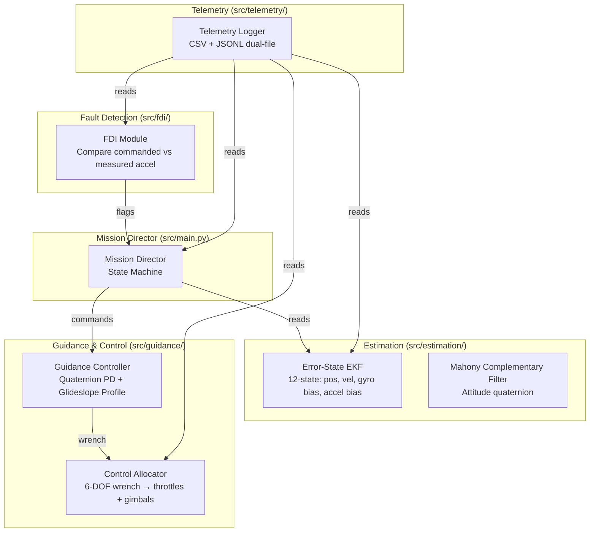

<div align="center">

# AEGIS

**Autonomous Estimation & Guidance Integrated System**

[](https://www.python.org/downloads/)
[](./LICENSE)
[]()

*A fault-tolerant autonomous landing system for Kerbal Space Program.*

AEGIS injects Gaussian noise into sensor telemetry and handles asymmetric engine failures during powered descent using state estimation, fault detection, and dynamic control allocation.

</div>

---

## Overview

AEGIS is an autonomous landing system utilizing a 50 Hz real-time control loop for multi-engine spacecraft. It fuses IMU, altimeter, and velocimeter data via a 12-state Extended Kalman Filter. It detects actuator faults and redistributes control authority across surviving engines to maintain stable descent after losing up to 4 of 8 engines.

- **Sensor Noise**: Telemetry (position, velocity, IMU, altimeter) is corrupted by Gaussian noise prior to estimation.
- **Asymmetric Engine Failures**: The Fault Detection & Isolation (FDI) module identifies engine failures from acceleration residuals and remaps control allocation.
- **Attitude Control**: Executed entirely via differential throttling and independent per-engine gimbal trim. Reaction wheels are not used.
- **Guidance**: Operates via a real-time sqrt glideslope profile computed from available thrust-to-weight ratio (TWR) and remaining altitude.

---

## Setup & Execution

AEGIS is contained within a Linux environment using WSL (Windows Subsystem for Linux) running the Arch distribution. Dependency management is handled by `uv`.

### Prerequisites
- Kerbal Space Program with the **kRPC** mod installed and server running.
- Windows Subsystem for Linux (WSL) running **Arch**.
- `uv` installed in WSL.

### Installation
```bash
wsl -d Arch
uv venv
uv pip install -r requirements.txt
```

### Running the Live Mission Director
Executes the live flight loop against KSP. Ensure the KSP kRPC server is active.
```bash
wsl -d Arch .venv/bin/python src/main.py [--debug] [--log-to-file]
```

### Running the Physics Simulation (Sandbox)
AEGIS includes a standalone physics sandbox for visualizing control allocation, Center of Mass (CoM) shifting, and descent logic without running KSP. It uses Raylib for 3D visualization.
```bash
wsl -d Arch .venv/bin/python scripts/visualize_physics.py
```

### Static Analysis and Tests
```bash
wsl -d Arch .venv/bin/mypy .
wsl -d Arch .venv/bin/pytest
```

---

## System Architecture



| Module | Files | Responsibility |
|--------|-------|----------------|
| **Mission Director** | `src/main.py` | Hierarchical state machine orchestrating flight phases and contingency branching (engine failures, degenerate allocation). |
| **State Estimator** | `src/estimation/ekf.py`, `src/estimation/mahony_estimator.py` | 12-state Error-State EKF fusing IMU, altimeter, and velocimeter. Mahony filter for attitude. Dynamic gravity model via kRPC body parameters. |
| **Fault Detection & Isolation** | `src/fdi/fdi.py` | Compares expected vs measured acceleration. Isolates engine failures. Triggers `HARD_ABORT` on multi-engine failures. |
| **Guidance & Control** | `src/guidance/controller.py`, `src/guidance/allocator.py` | Quaternion PD attitude control with inertia-scaled torque. Suicide-burn sqrt glideslope. 6-DOF pseudo-inverse control allocator with condition number verification. |
| **Telemetry & Logging** | `src/telemetry/` | Dual-file logging (CSV/JSONL). Buffered I/O to maintain 50Hz loop frequency. |

### State Machine

`STANDBY → ASCENT_COAST → DEORBIT_BURN → HYPERSONIC_COAST → POWERED_DESCENT → HOVER_TARGETING → TERMINAL_DESCENT → LANDED`

**Contingencies:**
- Single engine failure: FDI isolates, allocator remaps wrench.
- 2+ simultaneous failures: `HARD_ABORT`.
- Degenerate allocation (B matrix condition number > 1e4): `HARD_ABORT`.
- Vessel destroyed: `HARD_ABORT`.
- DT spike (>3× expected tick): Skips KF predict, holds FDI, guidance continues execution.

---

## Performance Metrics

| Metric | Value |
|--------|-------|
| **Control loop frequency** | 50 Hz |
| **Engines** | 8 |
| **Gimbal DOF** | Independent X/Y per engine |
| **State vector dimension** | 12 (EKF) + 4 (attitude) |

---

## Automated Hyperparameter Tuning

AEGIS includes an Optuna-based tuning script (`scripts/tune_config_optuna.py`) utilizing the TPE algorithm. It evaluates parameter sets against a standardized KSP save (`aegis_tune_start`), injecting parameters and computing a fitness score based on landing distance and fuel consumption. Results are stored in `logs/optuna.db`.

---

## Configuration

Runtime parameters are defined in `.conf` files under `src/config/`:
- `aegis.conf`: Mission parameters (altitude thresholds, approach gains).
- `ekf.conf`: EKF process/measurement noise covariance (Q/R).
- `engines.conf`: Engine specifications (thrust, ISP, gimbal limits).
- `glideslope.conf`: Suicide-burn profile parameters.
- `sensors.conf`: Sensor noise characteristics and FDI thresholds.
- `kRPC.conf`: kRPC server connection settings.

---

## NN-ADRC Integration

The guidance controller currently implements PD logic. The Active Disturbance Rejection Controller (ADRC) augmented by a Neural Network (NN) compensator is in development to provide disturbance rejection for asymmetric failures. The Extended State Observer (ESO) is located in Guidance (`src/guidance/adrc.py`).

---

## Documentation

- [Architecture Design](docs/architecture_design.md)
- [Vessel Design](docs/vessel_design.md)
- [Configuration Guide](docs/config.md)
- [Data Flow & Telemetry](docs/data_flow_telemetry.md)
- [Architecture Contracts](.agents/shared/context/ARCHITECTURE.md)
- [Architecture Decision Log](.agents/shared/context/DECISIONS.md)
- [Known Issues](.agents/shared/context/OPEN_ISSUES.md)
- [Mesh Extraction Workflow](docs/mesh_extraction_workflow.md)

---

## License

This project is licensed under the MIT License — see the [LICENSE](LICENSE) file for details.

---

## References

| # | Source | Used In |
|---|--------|---------|
| [1] | Cornman, L. & Mei, G. *Extended Kalman Filtering*. Stanford University. | State Estimator — Error-State EKF structure, Q/R tuning. |
| [2] | Leblebicioglu, K. et al. *NN Based Active Disturbance Rejection Controller for a Multi-Axis Gimbal System*. | NN-ADRC — ESO equations, `fal()` nonlinearity, WSEF/TG structure. |
| [3] | Elbeltagy, A. et al. *Quaternion-Based Tracking Control Law Design for Tracking Mode*. | Guidance controller — quaternion error, inertia-scaled PD torque. |
| [4] | Mahony, R., Hamel, T., & Pflimlin, J. *Nonlinear Complementary Filters on the Special Orthogonal Group*. | State Estimator — Mahony filter for attitude estimation. |
